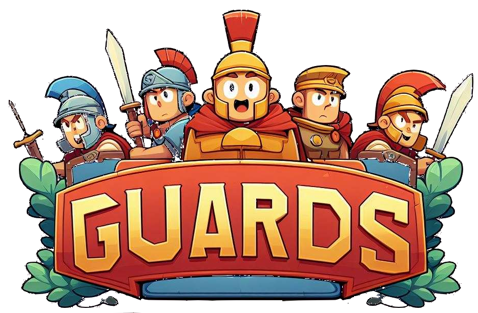

[

](https://github.com/hyperfocusaurus/guards/releases/latest)




# Guards!

Guards! is a digital board game based on a medieval board game called [murder in the
forum](https://www.thehistoricgamesshop.co.uk/onlineshop/prod_3710022-Murder-in-the-Forum.html).

The rules are quite straightforward:

One person plays as purple, the other as white.

The aim is simply to murder all citizens of the opposing faction.

Murdering is accomplished by cornering a citizen of the opposing faction - if they are surrounded only by either walls,
the magistrate, or enemy players, they are considered "murdered" and removed from play.  When a murder happens, the
guards change teams (they are initially neutral, and on the first murder will join the victim's team). The magistrate
also changes teams when a murder takes place, initially joining the murderer's team when the first murder takes place.

The Guards, represented by red tokens, can be used as part of a murder, but cannot be murdered themselves. They can only
be used to murder the team that does not currently control them.

The magistrate, represented by a black token, acts as a neutral blocking token at all times - so he can be used to
murder citizens of either team, essentially.

For convenience, the magistrate and guards will get dots representing which player controls them (purple or white)
whenever they are controlled by a player.

I'm not 100% sure I've got the rules completely right, so if you see something wrong - please raise an issue on github
or, if you know how to fix it yourself, submit a PR.

# Controls

```
left click: select a square to move from or to
right click: cancel current move
q: quit
```

# Credits

Code: Chris

Creative Consultant: Shaggy
